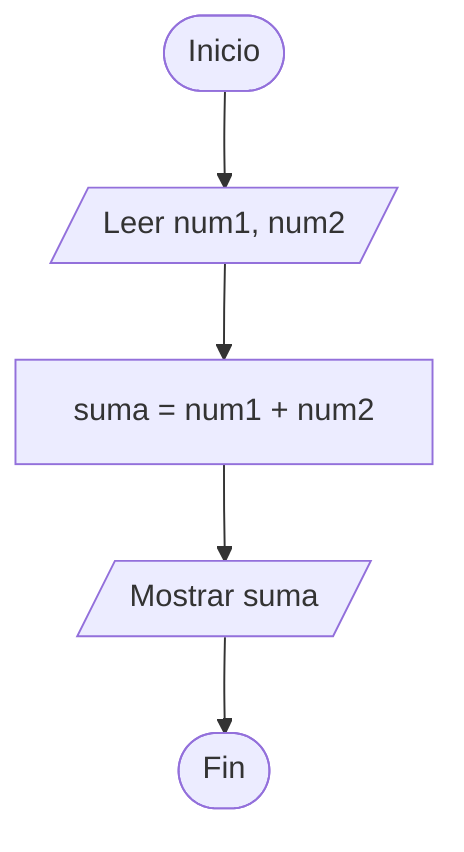

# Adición

## Información del Estudiante
- **Apellido:** Imeroni
- **Nombre:** Francisco
- **Legajo:** 209.030-2
- **Curso:** K1053
- **Año de cursada:** 2026

## Compilador Seleccionado
- **Compilador**: GCC 13.3.0
- **Estándar**: C++23

# Modelo IPO
| Entrada | Proceso | Salida |
| :--- | :--- | :--- |
| `num1`: entero | `suma = num1 + num2` | `suma`: entero |
| `num2`: entero | | |

### Representación del Algoritmo
#### Representación visual

#### Representación textual
1. Inicio.
2. Declarar variables `num1`, `num2` y `suma`.
3. Solicitar y leer los valores para `num1` y `num2`.
4. Asignar a `suma` el resultado de `num1 + num2`.
5. Informar el valor de `suma`.
